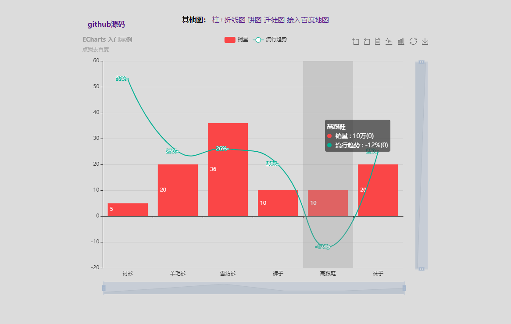
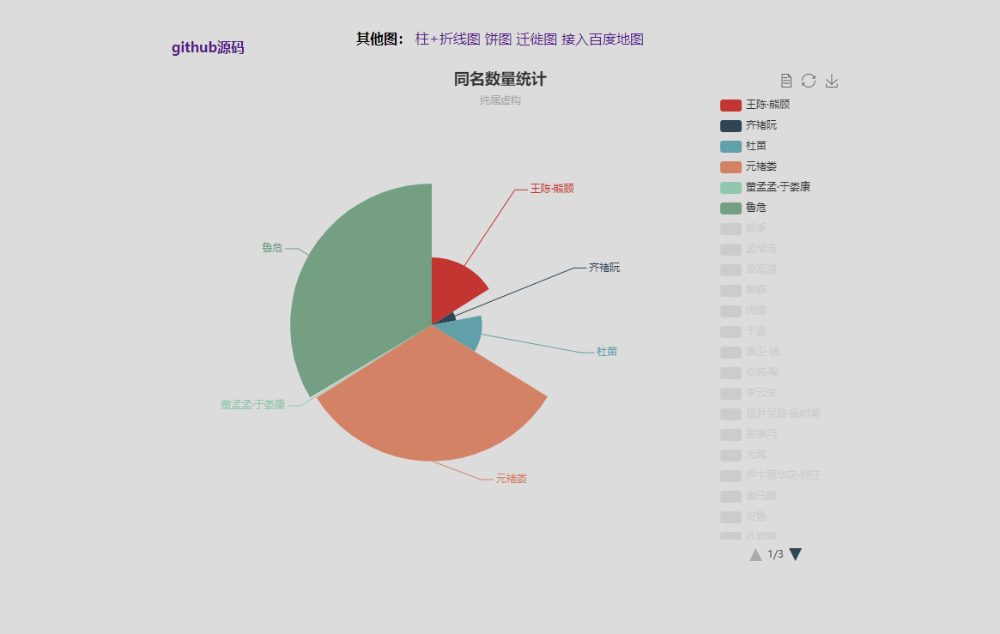
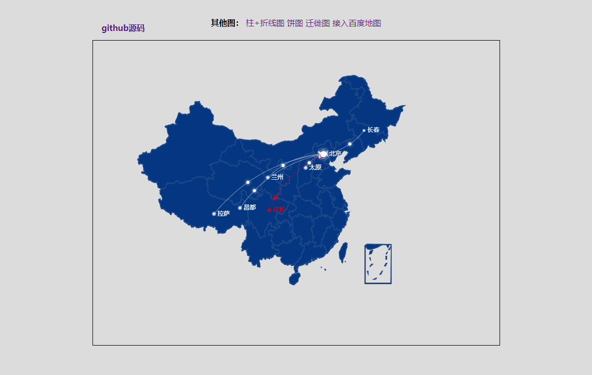
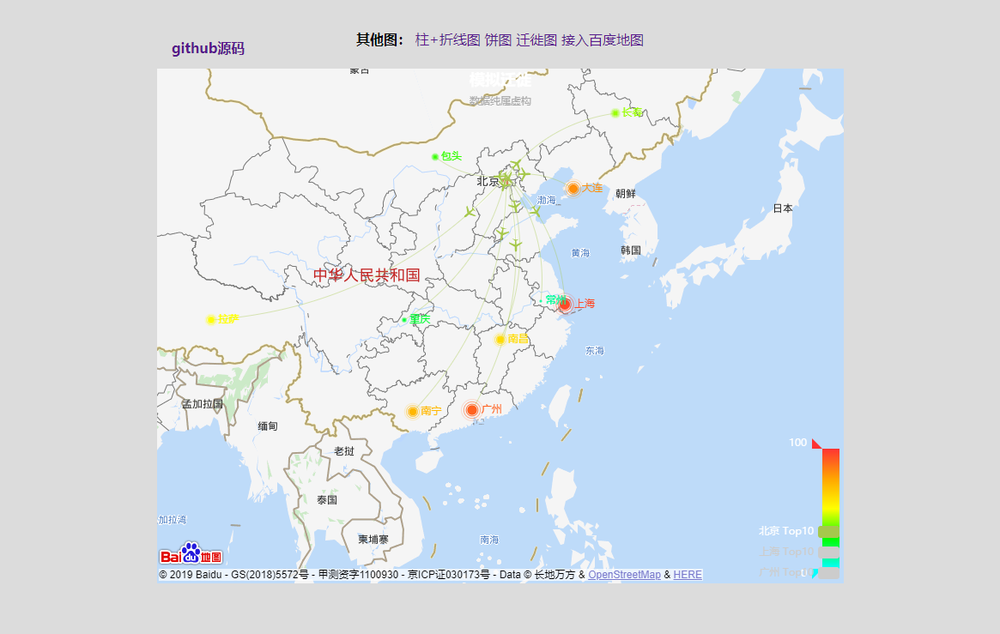

# ECharts Study

> 把常用的ECharts图表整理一下，方便日后的使用

## 常用网址

- 在ECharts官网运行编辑实例：https://www.echartsjs.com/gallery/editor.html?c=doc-example/getting-started
- ECharts`option`中各参数详细配置项：https://echarts.baidu.com/option.html#grid

## 图表展示如下

- 柱+折线图



- 饼图



- 迁徙图



- 接入百度地图



## 使用服务端返回数据的异步加载和更新

详见官网：[异步数据加载和更新](https://echarts.baidu.com/tutorial.html#异步数据加载和更新)

```javascript
function method(init的char,option参数,查询条件1,查询条件2,查询条件3){
	//ECharts 默认有提供了一个简单的加载动画。只需要调用 showLoading 方法显示。数据加载完成后再调用 hideLoading 方法隐藏加载动画。
    chart.showLoading({
		text: '加载中...'
	});
    
	$.ajax({
		type:"POST",
		data:{"查询条件1":查询条件1,'查询条件2':查询条件2,'查询条件3':查询条件3},
        url:"/zhidinglianjie",
        success:function(data){
           if(data){
               	/*注意填入数据的格式：
               	series: [{
                    // 根据名字对应到相应的系列
                    name: '销量',
                    data: [53, 25, 26, 20, 32, 25]
        		}]*/
				option.series[0].data =  data.data
				option.series[1].data = data.categories
				chart.setOption(option);
           }else{
                
           }
            //数据加载完成后再调用 hideLoading 方法隐藏加载动画。
			chart.hideLoading();
        },
        error:function(jqXHR){
			chart.hideLoading();
        }
	});
}
```

